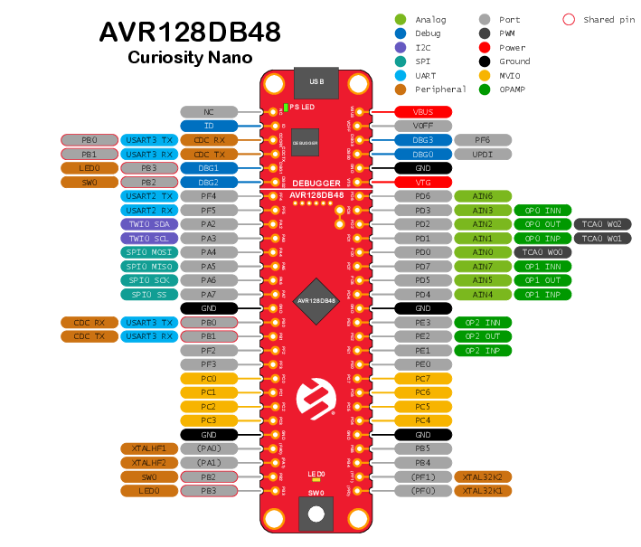

# Temperature Sensor System using AVR128DB48

## Overview
This project is a **collection of temperature sensing examples** for the **AVR128DB48 microcontroller**, demonstrating how to interface with different sensors using **USART, SPI, and I²C communication protocols**.

The system includes three implementations:

- **USART + ADC (AVR Assembly)** with **MCP9700A**  
- **SPI (C/C++)** with **LM74**  
- **I²C (C/C++)** with **LM75**

Each module operates independently and highlights **low-level embedded techniques**, including **direct register configuration, peripheral control, and mixed-language development (AVR assembly and C/C++)**. Temperature readings from all modules are displayed in real time on a **20×4 SerLCD**, providing a clear serial interface for monitoring sensor output.

Together, this collection demonstrates **high-speed temperature acquisition, sensor interfacing, and serial display output** across multiple communication protocols on the AVR128DB48.

---

## USART Temperature Sensor (AVR Assembly)

This implementation reads temperature from an **MCP9700A analog temperature sensor** using the **on-board ADC** of the AVR128DB48. The firmware is written entirely in **AVR assembly** to demonstrate low-level hardware control and the potential for **high-speed interrupt-driven implementations**.

### Operation
1. The **MCP9700A** outputs an analog voltage proportional to temperature.
2. The **AVR ADC module** samples this voltage and converts it into a digital value.
3. The converted temperature data is transmitted using the **USART peripheral**.
4. The temperature reading is displayed on the **20×4 SerLCD**.

### Key Features
- Pure **AVR assembly implementation**
- Direct **ADC register configuration**
- **USART serial communication**
- Real-time temperature display on **20×4 SerLCD**
- Demonstrates **analog sensor integration**

---

## SPI Temperature Sensor (C Implementation)

This module interfaces with an **LM74 digital temperature sensor** using the **SPI hardware module** of the AVR128DB48.

The firmware is written in **C/C++** and uses the microcontroller as an **SPI master** to retrieve temperature data from the LM74 sensor.

### Operation
1. The AVR128DB48 initializes the **SPI peripheral in master mode**.
2. A read transaction is initiated with the **LM74 sensor**.
3. The sensor returns the current temperature as a digital value.
4. The microcontroller processes the received data and displays the result on the **20×4 SerLCD**.

### Key Features
- **Hardware SPI communication**
- **Master–slave sensor interface**
- Efficient **digital temperature acquisition**
- Implemented in **embedded C/C++**
- Temperature output displayed on **20×4 SerLCD**

---

## I²C Temperature Sensor (C Implementation)

This implementation communicates with an **LM75 temperature sensor** using the **I²C (TWI) peripheral** of the AVR128DB48.

The structure is similar to the SPI module but uses the **I²C protocol** to read temperature registers from the sensor.

### Operation
1. The AVR initializes the **I²C (TWI) hardware module**.
2. The microcontroller sends a **read request to the LM75 sensor**.
3. The sensor returns temperature data stored in its internal registers.
4. The AVR reads and processes the data before displaying it on the **20×4 SerLCD**.

### Key Features
- **I²C/TWI hardware interface**
- Communication with **LM75 digital temperature sensor**
- **Register-based temperature readout**
- Implemented in **embedded C/C++**
- Temperature output displayed on **20×4 SerLCD**
